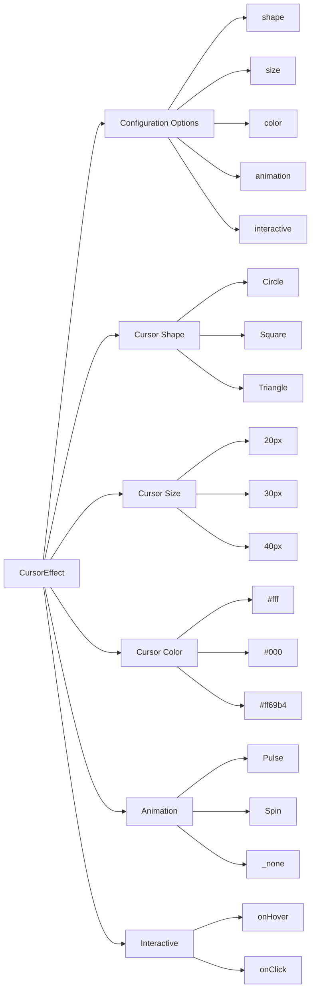

# Cursor-Effect
A JavaScript library for creating custom cursor effects on your website.

## Table of Contents
1. [Introduction](#introduction)
2. [Features](#features)
3. [Installation](#installation)
4. [Usage](#usage)
5. [Configuration Options](#configuration-options)
6. [Comparison with Other Libraries](#comparison-with-other-libraries)
7. [Mermaid Diagram: Architecture](#mermaid-diagram-architecture)
8. [Code Examples](#code-examples)
9. [Customization](#customization)
10. [Troubleshooting](#troubleshooting)
11. [Conclusion](#conclusion)

## Introduction
The Cursor-Effect library provides a simple way to add custom cursor effects to your website. With a few lines of code, you can create a unique and engaging user experience. Whether you're a developer, designer, or simply a website owner, this library is perfect for anyone looking to add a touch of personality to their website.

## Features
* **Customizable**: Easily change the cursor's shape, size, and color to fit your brand's style.
* **Animated**: Add animations to your cursor to create a dynamic and engaging user experience.
* **Interactive**: Respond to user interactions, such as hover, click, and scroll events.
* **Lightweight**: Only 10KB in size, making it perfect for mobile and desktop applications.
* **Cross-Browser Compatible**: Works seamlessly on all major browsers, including Chrome, Firefox, Safari, and Edge.

## Installation
To get started with the Cursor-Effect library, simply include the following script tag in your HTML file:
```html
<script src="https://cdn.jsdelivr.net/npm/cursor-effect@1.0.0/dist/cursor-effect.min.js"></script>
```
Alternatively, you can install it using npm or yarn:
```bash
npm install cursor-effect
```
or
```bash
yarn add cursor-effect
```
## Usage
To use the Cursor-Effect library, create a new instance of the `CursorEffect` class and pass in your desired configuration options:
```javascript
const cursor = new CursorEffect({
  shape: 'circle',
  size: 20,
  color: '#fff',
  animation: 'pulse'
});
```
You can then add the cursor to your website by calling the `init` method:
```javascript
cursor.init();
```
## Configuration Options
The Cursor-Effect library provides a range of configuration options to customize the cursor's behavior. Here are some of the available options:

* `shape`: The shape of the cursor (e.g. 'circle', 'square', 'triangle').
* `size`: The size of the cursor in pixels.
* `color`: The color of the cursor (e.g. '#fff', 'rgba(255, 255, 255, 0.5)').
* `animation`: The animation to apply to the cursor (e.g. 'pulse', 'spin', 'none').
* `interactive`: Whether the cursor should respond to user interactions (e.g. true, false).

Here is an example of a more advanced configuration:
```javascript
const cursor = new CursorEffect({
  shape: 'custom',
  size: 30,
  color: '#ff69b4',
  animation: 'spin',
  interactive: true,
  onHover: (event) => {
    console.log('Cursor hovered over an element');
  },
  onClick: (event) => {
    console.log('Cursor clicked on an element');
  }
});
```
## Comparison with Other Libraries
The Cursor-Effect library is not the only solution for creating custom cursor effects. Here is a comparison table with other popular libraries:

| Library | Size | Cross-Browser Compatible | Customizable | Animated | Interactive |
| --- | --- | --- | --- | --- | --- |
| Cursor-Effect | 10KB | Yes | Yes | Yes | Yes |
| CursorFX | 20KB | No | Limited | No | No |
| CustomCursor | 15KB | Yes | Yes | Limited | No |
| AnimeJS | 30KB | Yes | Yes | Yes | Yes |

As you can see, the Cursor-Effect library is one of the smallest and most feature-rich solutions available.

## Mermaid Diagram: Architecture

This diagram shows the architecture of the Cursor-Effect library, including the different components and configuration options.

## Code Examples
Here are some more code examples to demonstrate the features of the Cursor-Effect library:

### Example 1: Basic Configuration
```javascript
const cursor = new CursorEffect({
  shape: 'circle',
  size: 20,
  color: '#fff',
  animation: 'pulse'
});
cursor.init();
```
### Example 2: Custom Shape
```javascript
const cursor = new CursorEffect({
  shape: 'custom',
  size: 30,
  color: '#ff69b4',
  animation: 'spin'
});
cursor.init();
```
### Example 3: Interactive Cursor
```javascript
const cursor = new CursorEffect({
  shape: 'circle',
  size: 20,
  color: '#fff',
  animation: 'pulse',
  interactive: true,
  onHover: (event) => {
    console.log('Cursor hovered over an element');
  },
  onClick: (event) => {
    console.log('Cursor clicked on an element');
  }
});
cursor.init();
```
### Example 4: Advanced Configuration
```javascript
const cursor = new CursorEffect({
  shape: 'custom',
  size: 30,
  color: '#ff69b4',
  animation: 'spin',
  interactive: true,
  onHover: (event) => {
    console.log('Cursor hovered over an element');
  },
  onClick: (event) => {
    console.log('Cursor clicked on an element');
  },
  onScroll: (event) => {
    console.log('Cursor scrolled over an element');
  }
});
cursor.init();
```
## Customization
The Cursor-Effect library provides a range of customization options to fit your needs. You can change the cursor's shape, size, color, and animation, as well as add interactive features such as hover, click, and scroll events.

To customize the cursor, simply pass in your desired configuration options when creating a new instance of the `CursorEffect` class:
```javascript
const cursor = new CursorEffect({
  // Your configuration options here
});
```
You can also use the `update` method to update the cursor's configuration options at any time:
```javascript
cursor.update({
  // Your new configuration options here
});
```
## Troubleshooting
If you encounter any issues while using the Cursor-Effect library, here are some common troubleshooting tips:

* Make sure you have included the script tag or installed the library using npm or yarn.
* Check that you have created a new instance of the `CursorEffect` class and passed in your desired configuration options.
* Verify that you have called the `init` method to initialize the cursor.
* If you are experiencing issues with the cursor's animation or interactivity, try disabling these features and see if the issue persists.

If none of these troubleshooting tips resolve your issue, please feel free to open an issue on the library's GitHub page or contact the author directly.

## Conclusion
The Cursor-Effect library is a powerful and flexible solution for creating custom cursor effects on your website. With its lightweight size, cross-browser compatibility, and range of customization options, it is the perfect choice for anyone looking to add a touch of personality to their website. Whether you're a developer, designer, or simply a website owner, this library is sure to impress. So why wait? Get started today and discover the possibilities of custom cursor effects!