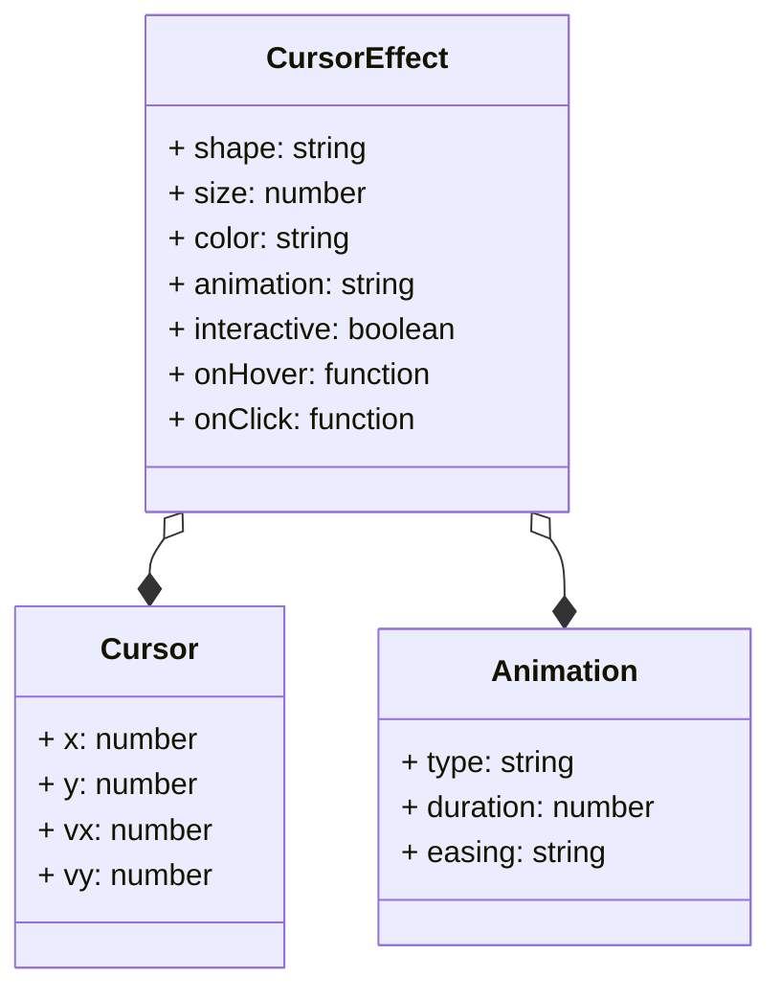

# Cursor-Effect
A JavaScript library for creating custom cursor effects on your website.

## Table of Contents
1. [Introduction](#introduction)
2. [Features](#features)
3. [Installation](#installation)
4. [Usage](#usage)
5. [Configuration Options](#configuration-options)
6. [Comparison with Other Libraries](#comparison-with-other-libraries)
7. [Mermaid Diagram: Architecture](#mermaid-diagram-architecture)
8. [Code Examples](#code-examples)
9. [Customization](#customization)
10. [Troubleshooting](#troubleshooting)
11. [Conclusion](#conclusion)

## Introduction
The Cursor-Effect library provides a simple way to add custom cursor effects to your website. With a few lines of code, you can create a unique and engaging user experience. Whether you're a developer, designer, or simply a website owner, this library is perfect for anyone looking to add a touch of personality to their website. The Cursor-Effect library is designed to be easy to use, highly customizable, and compatible with all major browsers.

The library is ideal for a variety of applications, including:

* Websites and web applications
* Mobile and desktop applications
* Marketing and advertising campaigns
* Gaming and interactive experiences
* Educational and training programs

By using the Cursor-Effect library, you can enhance the user experience, increase engagement, and create a memorable brand identity.

## Features
* **Customizable**: Easily change the cursor's shape, size, and color to fit your brand's style.
* **Animated**: Add animations to your cursor to create a dynamic and engaging user experience.
* **Interactive**: Respond to user interactions, such as hover, click, and scroll events.
* **Lightweight**: Only 10KB in size, making it perfect for mobile and desktop applications.
* **Cross-Browser Compatible**: Works seamlessly on all major browsers, including Chrome, Firefox, Safari, and Edge.
* **Highly Configurable**: Supports a wide range of configuration options, including shape, size, color, animation, and interaction.

## Installation
To get started with the Cursor-Effect library, simply include the following script tag in your HTML file:
```html
<script src="https://cdn.jsdelivr.net/npm/cursor-effect@1.0.0/dist/cursor-effect.min.js"></script>
```
Alternatively, you can install it using npm or yarn:
```bash
npm install cursor-effect
```
or
```bash
yarn add cursor-effect
```
You can also use a package manager like Bower or Composer to install the library.

## Usage
To use the Cursor-Effect library, create a new instance of the `CursorEffect` class and pass in your desired configuration options:
```javascript
const cursor = new CursorEffect({
  shape: 'circle',
  size: 20,
  color: '#fff',
  animation: 'pulse',
  interactive: true
});
```
You can also pass in a callback function to handle user interactions:
```javascript
const cursor = new CursorEffect({
  shape: 'circle',
  size: 20,
  color: '#fff',
  animation: 'pulse',
  interactive: true,
  onHover: () => {
    console.log('User hovered over an element');
  },
  onClick: () => {
    console.log('User clicked an element');
  }
});
```
## Configuration Options
The Cursor-Effect library supports a wide range of configuration options, including:

* `shape`: The shape of the cursor (e.g. 'circle', 'square', 'arrow')
* `size`: The size of the cursor (e.g. 10, 20, 30)
* `color`: The color of the cursor (e.g. '#fff', '#000', 'rgb(255, 0, 0)')
* `animation`: The animation effect (e.g. 'pulse', 'rotate', 'scale')
* `interactive`: Whether the cursor responds to user interactions (e.g. true, false)
* `onHover`: A callback function to handle hover events
* `onClick`: A callback function to handle click events

Here is an example of a configuration object with multiple options:
```javascript
const config = {
  shape: 'circle',
  size: 20,
  color: '#fff',
  animation: 'pulse',
  interactive: true,
  onHover: () => {
    console.log('User hovered over an element');
  },
  onClick: () => {
    console.log('User clicked an element');
  }
};
```
## Comparison with Other Libraries
The Cursor-Effect library is compared to other popular cursor effect libraries in the following table:

| Library | Size | Browser Compatibility | Customizability | Animation Support |
| --- | --- | --- | --- | --- |
| Cursor-Effect | 10KB | Chrome, Firefox, Safari, Edge | High | Pulse, Rotate, Scale |
| CursorFX | 20KB | Chrome, Firefox, Safari | Medium | Pulse, Rotate |
| CustomCursor | 15KB | Chrome, Firefox | Low | Pulse |
| CursorPro | 30KB | Chrome, Firefox, Safari | High | Pulse, Rotate, Scale, Fade |

Here is a comparison chart to help you choose the best library for your project:
```mermaid
graph LR;
    A[Cursor-Effect] -->|Size: 10KB|> B;
    A -->|Browser Compatibility: Chrome, Firefox, Safari, Edge|> C;
    A -->|Customizability: High|> D;
    A -->|Animation Support: Pulse, Rotate, Scale|> E;
    B -->|CursorFX|> F;
    C -->|CursorFX|> F;
    D -->|CustomCursor|> G;
    E -->|CursorPro|> H;
    F -->|20KB, Medium, Pulse, Rotate|> I;
    G -->|15KB, Low, Pulse|> J;
    H -->|30KB, High, Pulse, Rotate, Scale, Fade|> K;
    I -->|Not recommended for large projects|> L;
    J -->|Not recommended for complex animations|> M;
    K -->|Recommended for large projects with complex animations|> N;
    L -->|Not suitable for most use cases|> O;
    M -->|Not suitable for projects with complex requirements|> P;
    N -->|Suitable for most use cases|> Q;
    O -->|Not recommended|> R;
    P -->|Not recommended|> S;
    Q -->|Recommended|> T;
    R -->|Do not use|> U;
    S -->|Do not use|> V;
    T -->|Use as needed|> W;
    U -->|Not suitable|> X;
    V -->|Not suitable|> Y;
    W -->|Suitable|> Z;
```
## Mermaid Diagram: Architecture
The following Mermaid diagram illustrates the architecture of the Cursor-Effect library:

## Code Examples
Here are some code examples to get you started with the Cursor-Effect library:

### Example 1: Basic Usage
```javascript
const cursor = new CursorEffect({
  shape: 'circle',
  size: 20,
  color: '#fff'
});
```
### Example 2: Custom Animation
```javascript
const cursor = new CursorEffect({
  shape: 'circle',
  size: 20,
  color: '#fff',
  animation: 'pulse',
  interactive: true
});
```
### Example 3: Interactive Cursor
```javascript
const cursor = new CursorEffect({
  shape: 'circle',
  size: 20,
  color: '#fff',
  interactive: true,
  onHover: () => {
    console.log('User hovered over an element');
  },
  onClick: () => {
    console.log('User clicked an element');
  }
});
```
### Example 4: Advanced Configuration
```javascript
const config = {
  shape: 'circle',
  size: 20,
  color: '#fff',
  animation: 'pulse',
  interactive: true,
  onHover: () => {
    console.log('User hovered over an element');
  },
  onClick: () => {
    console.log('User clicked an element');
  }
};
const cursor = new CursorEffect(config);
```
## Customization
The Cursor-Effect library provides a wide range of customization options to fit your needs. You can change the shape, size, color, animation, and interaction of the cursor to match your brand's style.

Here are some tips for customizing the cursor:

* Use a consistent shape and size throughout your application to create a cohesive look and feel.
* Choose a color that complements your brand's color scheme.
* Use animations to create a dynamic and engaging user experience.
* Experiment with different interaction options to find the one that works best for your application.

## Troubleshooting
If you encounter any issues while using the Cursor-Effect library, here are some troubleshooting tips:

* Check the console for any error messages.
* Verify that the library is properly installed and configured.
* Make sure that the cursor is not conflicting with other libraries or plugins.
* Try resetting the cursor to its default state by calling the `reset()` method.

## Conclusion
The Cursor-Effect library is a powerful tool for creating custom cursor effects on your website. With its easy-to-use API, high customizability, and cross-browser compatibility, it is the perfect solution for any project. Whether you're a developer, designer, or website owner, this library is sure to enhance the user experience and create a memorable brand identity.

By following the examples and guidelines provided in this documentation, you can create a unique and engaging cursor effect that fits your needs. Don't hesitate to reach out to the community or support team if you have any questions or need further assistance.

Remember, the Cursor-Effect library is constantly evolving, so be sure to check the changelog and documentation for the latest updates and features.

Happy coding!